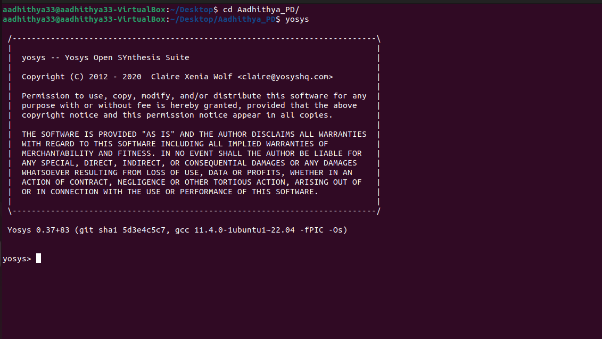

# VSD-HDP
This repository contains all the necessary files and steps to implement the RTL-to-GDSII flow.
### **DAY 0**
Install [oracle VM virtual box](https://www.virtualbox.org/wiki/Downloads) and install ubuntu in oracle VM virtual box.
If system has 16GB RAM and 512GB HDD then allocate 8GB RAM and 100 GB HDD for oracle VM virtual box.
**INSTALLATION OF OPEN SOURCE EDA TOOLS (Yosys, iverilog, and, gtwave)** :
**1.Yosys**:
Open terminal in ubuntu and use the commands shown below to install Yosys:
`git clone https://github.com/YosysHQ/yosys.git
cd yosys-master 
sudo apt install make 
sudo apt-get install build-essential clang bison flex \
    libreadline-dev gawk tcl-dev libffi-dev git \
    graphviz xdot pkg-config python3 libboost-system-dev \
    libboost-python-dev libboost-filesystem-dev zlib1g-dev
make 
sudo make install`

Below screenshot shows successful installation and launching of Yosys

**2.iverilog:**
Open terminal in ubuntu and use the commands shown below to install iverilog
`sudo apt-get install iverilog`

Below screenshot shows successful installation and launching of iverilog:

Open terminal in ubuntu and use the commands shown below to install gtwave:
`sudo apt-get install gtkwave`

Below screenshot shows successful installation and launching of gtwave:

