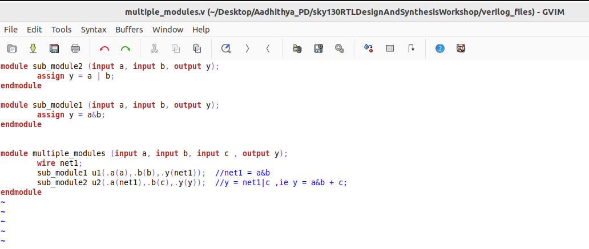
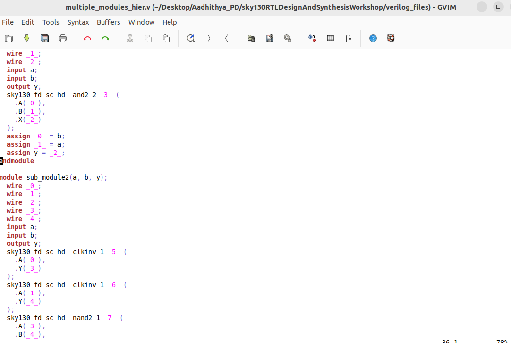

# VSD-Hardware Design program
This repository contains all the necessary steps and files to implement the RTL-to-GDSII flow.


[Day 0-Installation of EDA Tools](#day-0)

[Day 1-Introduction to Verilog RTL design and Synthesis](#day-1)

[Day 2-Timing libs, hierarchical vs flat synthesis and efficient flop coding styles](#day-2)


## DAY 0
Install [oracle VM virtual box](https://www.virtualbox.org/wiki/Downloads) and install ubuntu in oracle VM virtual box.
If system has 16GB RAM and 512GB HDD then allocate 8GB RAM and 100 GB HDD for oracle VM virtual box.

**INSTALLATION OF OPEN SOURCE EDA TOOLS (Yosys, iverilog, and, gtkwave)** :

**1.Yosys**:
Open terminal in ubuntu and use the commands shown below to install Yosys:

```bash
git clone https://github.com/YosysHQ/yosys.git
cd yosys-master 
sudo apt install make 
sudo apt-get install build-essential clang bison flex \
    libreadline-dev gawk tcl-dev libffi-dev git \
    graphviz xdot pkg-config python3 libboost-system-dev \
    libboost-python-dev libboost-filesystem-dev zlib1g-dev
make config-gcc
make 
sudo make install
```

Below screenshot shows successful installation and launching of Yosys


**2.iverilog:**
Open terminal in ubuntu and use the commands shown below to install iverilog
```bash
sudo apt-get install iverilog
```

Below screenshot shows successful installation and launching of iverilog:


**3.gtkwave:**

Open terminal in ubuntu and use the commands shown below to install gtkwave:
```bash
sudo apt-get install gtkwave
```

Below screenshot shows successful installation and launching of gtkwave:


## DAY 1

    
* RTL design is implementation of specifications.

* To check whether the design meets specifications, we need a test bench to test it under different stimulus.

* We need a tool to check whether the RTL design meets specifications. iverilog is an opensource eda tool which can be used to check the functionality of design.

* The important point is that tool looks for only changes in the input and generates the changes in the output.
  


## **RTL design and synthesis of two input MUX:**

* This [repository](https://github.com/kunalg123/sky130RTLDesignAndSynthesisWorkshop.git) contains all the verilog codes and its corresponding testbenches. Now clone the repository to your directory using git clone command.

## **iverilog based simulation flow:**

* We have to provide Verilog code and corresponding test bench to the iverilog tool and the iverilog tool generates **a.out** file

**command to perform above operation**  
```bash
iverilog good_mux.v tb_good_mux.v
```
* We need to execute **a.out** file using the command shown below:

```bash
./a.out
```
* After execution **a.out** file , it is going to dump **VCD**(value change dump) file.

* We have to provide **VCD** file to gtkwave to view the waveform.

* Command to launch gtkwave is shown below

```bash
gtkwave tb_good_mux.vcd
```

* After executing the above command, you will see a waveform just like the image shown below:


## Synthesis using Yosys:

* Yosys is an open source eda tools which is used convert RTL code to gate level netlist.

* We have to provide .lib file and verilog code file to the synthesizer **Yosys** . Then it generates a netlist of the verilog code using standard cells in the .lib file 

* .Lib file contains collection of logical modules like all basic gates and different flavours of same gate. We have to use required gate to meet specifications using **SDC** constraints.

* Now launch **Yosys** using the command shown below:

 ```bash
yosys
```
* Now we have to read **.lib** file using the command shown below:

```bash
read_liberty -lib <path to the .lib file>
```
* Now we have to read **verilog** file using the command shown below:

```bash
read_verilog good_mux.v
```
* After executing the above command you should get a message saying that **successfully finished verilog frontend**.

* Now synthesis can be performed using the command shown below:

```bash
synth -top good_mux
```
* To generate the netlist use the command shown below:
 
```bash
abc -liberty <path to .lib file>
``` 
* To see the logic it has realized to generate the netlist use the command shown below:

```bash
show
```
* 2-input mux is realized like this:


* The command to write the netlist is shown below:

 ```bash
write_verilog good_mux_netlist.v
```

* netlist looks like this 


* To write the netlist which is more clear than the previous one ,then use the following command:

 ```bash
write_verilog -noattr good_mux_netlist.v
```

## DAY 2

<details>
    
<summary>1.Timings Libs</summary>

* Timing Libs contains different type of gates.


* In the above image you can notice the library **sky130_fd_sc_hd_tt_025C_1v80**. tt refers to typical process, 025c refers to temperature and, 1v80 refers to voltage. We want the chip to work correctly irrespective of process, voltage and, temperture.


* In the above image you can notice different leakage power for same gate for different combinations of input. Similarly .lib file contains many combinations of same cells and their properties.


    
</details>

<details>
<summary>2.Hierarchical vs flat synthesis</summary>

<details>
    
<summary>2a.Hierarchical</summary>

* To understand the difference between hierarchical vs flat synthesis.Let's consider a multiple_modules.v (this verilog code is present in **../sky130RTLDesignAndSynthesisWorkshop/verilog_files**).



* From the above verilog code we can easily see that it contains OR gate(sub_module2) and AND gate(sub_module1) and these are instantiated in the multliple_modules block.

* After synthesis, the netlist contains same submodules which are instantiated in the multiple_modules.
 

* But **or** gate is implemented using Nand gate and inverters. Because nand gate contains stacked nmos transistors and synthesis tool did because stacked pmos transistors are not recommended because if we want to implement using PMOS stack then we need increase size of pmos stack to compensate for the less mobility.

* You can observe that in the image shown below.



</details>
<details>
<summary>2b.Flat synthesis</summary>

* In heirarchical synthesis heirarchy is preserved whereas in flat synthesis heirarchy is flattened.
* To view flat synthesis netlist use command **flatten** then type the command **show**. Then you will get a netlist for the multiple_modules.v code.
* Netlist is shown below.
 


* From the above image you can notice that heirarchy is flattened.
    
</details>
<details>
<summary>2c.Sub module synthesis</summary>

* Sub module synthesis is used when we have multiple instances of same module.
* It is also used when we have massive design. In this scenario synthesis tool uses **divide and conquer** method.
* By using command **synth -top submodule1** we can synthesis only submodule1. whereas in previous case we have synthesized entire multiple_modules.
* Below image shows the netlist of submodule1.
 


</details>
    
</details>

<details>
<summary>3.Efficient flop coding styles</summary>
    
 **WHY FLOPS?**
    
* If we just use combinational circuits then we encounter glitches.To avoid glitches we need flops in between combinational circuits.
* In flipflops we can have asynchronous set, asynchronous reset, synchronous set and, synchronous reset.

<details>
    <summary>3a.DFF_asynchronous reset</summary>

**commands to perform simulation:**

```bash
iverilog dff_asyncresv.v tb_dff_asyncres.v
./a.out
gtkwave tb_dff_asyncresv.vcd
```
* Simulation of dff_asyncres.v is shown below:


**commands to perform synthesis:**

*If we have flops in our design then we have to use one extra command in yosys .That is **dfflibmap** .

```bash
read_verilog dff_asynres.v
read_liberty -lib <path to lib file>
synth -top dff_asyncres
dfflibmap -liberty <path to lib file>
abc -liberty <path to lib file>
write_verilog -noattr dff_asyncres_netlist.v
show
```
* Synthesis of dff_asyncres.v is shown below.
* 

  
    
</details>


    
</details>


