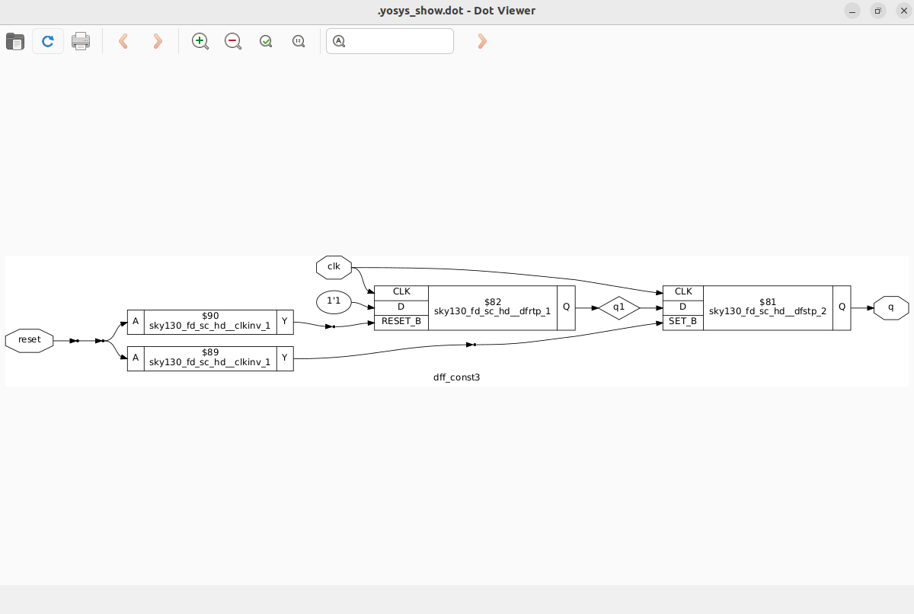
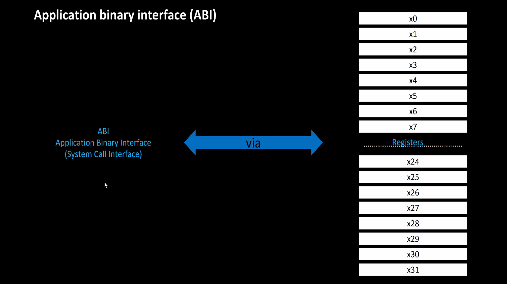

# VSD-Hardware Design program
This repository contains all the necessary steps and files to implement the RTL-to-GDSII flow.


[Day 0-Installation of EDA Tools](#day-0)

[Day 1-Introduction to Verilog RTL design and Synthesis](#day-1)

[Day 2-Timing libs, hierarchical vs flat synthesis and efficient flop coding styles](#day-2)

[Day 3-Combinational and sequential optimizations](#day-3)

[Day 4-GLS,blocking vs non-blocking and Synthesis-Simulation mismatch](#day-4)

[Day 5-Introduction to RISC-V ISA and GNU compiler tool chain](#day-5)

[Day 6-Introduction to ABI and basic verification flow](#day-6)

[Day 7-RTL and GLS simulation of RISCV ](#day-7)


## DAY 0
Install [oracle VM virtual box](https://www.virtualbox.org/wiki/Downloads) and install ubuntu in oracle VM virtual box.
If system has 16GB RAM and 512GB HDD then allocate 8GB RAM and 100 GB HDD for oracle VM virtual box.
<details>
    
<summary>INSTALLATION OF OPEN SOURCE EDA TOOLS (Yosys, iverilog, and, gtkwave)</summary>

**1.Yosys**:
Open terminal in ubuntu and use the commands shown below to install Yosys:

```bash
git clone https://github.com/YosysHQ/yosys.git
cd yosys-master 
sudo apt install make 
sudo apt-get install build-essential clang bison flex \
    libreadline-dev gawk tcl-dev libffi-dev git \
    graphviz xdot pkg-config python3 libboost-system-dev \
    libboost-python-dev libboost-filesystem-dev zlib1g-dev
make config-gcc
make 
sudo make install
```

Below screenshot shows successful installation and launching of Yosys


**2.iverilog:**
Open terminal in ubuntu and use the commands shown below to install iverilog
```bash
sudo apt-get install iverilog
```

Below screenshot shows successful installation and launching of iverilog:


**3.gtkwave:**

Open terminal in ubuntu and use the commands shown below to install gtkwave:
```bash
sudo apt-get install gtkwave
```

Below screenshot shows successful installation and launching of gtkwave:


</details>

## DAY 1

    
* RTL design is implementation of specifications.

* To check whether the design meets specifications, we need a test bench to test it under different stimulus.

* We need a tool to check whether the RTL design meets specifications. iverilog is an opensource eda tool which can be used to check the functionality of design.

* The important point is that tool looks for only changes in the input and generates the changes in the output.
  


## **RTL design and synthesis of two input MUX:**

* This [repository](https://github.com/kunalg123/sky130RTLDesignAndSynthesisWorkshop.git) contains all the verilog codes and its corresponding testbenches. Now clone the repository to your directory using git clone command.
<details>
 <summary>iverilog based simulation flow</summary>

* We have to provide Verilog code and corresponding test bench to the iverilog tool and the iverilog tool generates **a.out** file

**command to perform above operation**  
```bash
iverilog good_mux.v tb_good_mux.v
```
* We need to execute **a.out** file using the command shown below:

```bash
./a.out
```
* After execution **a.out** file , it is going to dump **VCD**(value change dump) file.

* We have to provide **VCD** file to gtkwave to view the waveform.

* Command to launch gtkwave is shown below

```bash
gtkwave tb_good_mux.vcd
```

* After executing the above command, you will see a waveform just like the image shown below:


</details>

<details>
<summary>Synthesis using Yosys:</summary>

* Yosys is an open source eda tools which is used convert RTL code to gate level netlist.

* We have to provide .lib file and verilog code file to the synthesizer **Yosys** . Then it generates a netlist of the verilog code using standard cells in the .lib file 

* .Lib file contains collection of logical modules like all basic gates and different flavours of same gate. We have to use required gate to meet specifications using **SDC** constraints.

* Now launch **Yosys** using the command shown below:

 ```bash
yosys
```
* Now we have to read **.lib** file using the command shown below:

```bash
read_liberty -lib <path to the .lib file>
```
* Now we have to read **verilog** file using the command shown below:

```bash
read_verilog good_mux.v
```
* After executing the above command you should get a message saying that **successfully finished verilog frontend**.

* Now synthesis can be performed using the command shown below:

```bash
synth -top good_mux
```
* To generate the netlist use the command shown below:
 
```bash
abc -liberty <path to .lib file>
``` 
* To see the logic it has realized to generate the netlist use the command shown below:

```bash
show
```
* 2-input mux is realized like this:


* The command to write the netlist is shown below:

 ```bash
write_verilog good_mux_netlist.v
```

* netlist looks like this 


* To write the netlist which is more clear than the previous one ,then use the following command:

 ```bash
write_verilog -noattr good_mux_netlist.v
```

</details>

## DAY 2

<details>
    
<summary>1.Timings Libs</summary>

* Timing Libs contains different type of gates.


* In the above image you can notice the library **sky130_fd_sc_hd_tt_025C_1v80**. tt refers to typical process, 025c refers to temperature and, 1v80 refers to voltage. We want the chip to work correctly irrespective of process, voltage and, temperture.


* In the above image you can notice different leakage power for same gate for different combinations of input. Similarly .lib file contains many combinations of same cells and their properties.


    
</details>

<details>
<summary>2.Hierarchical vs flat synthesis</summary>

<details>
    
<summary>2a.Hierarchical</summary>

* To understand the difference between hierarchical vs flat synthesis.Let's consider a multiple_modules.v (this verilog code is present in **../sky130RTLDesignAndSynthesisWorkshop/verilog_files**).


* From the above verilog code we can easily see that it contains OR gate(sub_module2) and AND gate(sub_module1) and these are instantiated in the multliple_modules block.

* After synthesis, the netlist contains same submodules which are instantiated in the multiple_modules.
 

* But **or** gate is implemented using Nand gate and inverters. Because nand gate contains stacked nmos transistors and synthesis tool did because stacked pmos transistors are not recommended because if we want to implement using PMOS stack then we need increase size of pmos stack to compensate for the less mobility.

* You can observe that in the image shown below.


</details>
<details>
<summary>2b.Flat synthesis</summary>

* In heirarchical synthesis heirarchy is preserved whereas in flat synthesis heirarchy is flattened.
* To view flat synthesis netlist use command **flatten** then type the command **show**. Then you will get a netlist for the multiple_modules.v code.
* Netlist is shown below.
 


* From the above image you can notice that heirarchy is flattened.
    
</details>
<details>
<summary>2c.Sub module synthesis</summary>

* Sub module synthesis is used when we have multiple instances of same module.
* It is also used when we have massive design. In this scenario synthesis tool uses **divide and conquer** method.
* By using command **synth -top submodule1** we can synthesis only submodule1. whereas in previous case we have synthesized entire multiple_modules.
* Below image shows the netlist of submodule1.
 


</details>
    
</details>

<details>
<summary>3.Efficient flop coding styles</summary>
    
 **WHY FLOPS?**
    
* If we just use combinational circuits then we encounter glitches.To avoid glitches we need flops in between combinational circuits.
* In flipflops we can have asynchronous set, asynchronous reset, synchronous set and, synchronous reset.

<details>
    <summary>3a.DFF_asynchronous reset</summary>

* commands to perform simulation:

```bash
iverilog dff_asyncres.v tb_dff_asyncres.v
./a.out
gtkwave tb_dff_asyncres.vcd
```
* Simulation of dff_asyncres.v is shown below:


* commands to perform synthesis:

* If we have flops in our design then we have to use one extra command in yosys .That is **dfflibmap** .

```bash
read_verilog dff_asyncres.v
read_liberty -lib <path to lib file>
synth -top dff_asyncres
dfflibmap -liberty <path to lib file>
abc -liberty <path to lib file>
write_verilog -noattr dff_asyncres_netlist.v
show
```
* Synthesis of dff_asyncres.v is shown below.
  

  
    
</details>

<details>
    <summary>3b.DFF_asynchronous set</summary>

* commands to perform simulation:

```bash
iverilog dff_async_set.v tb_dff_async_set.v
./a.out
gtkwave tb_dff_async_set.vcd
```
* Simulation of dff_async_set.v is shown below:


* commands to perform synthesis:

* If we have flops in our design then we have to use one extra command in yosys .That is **dfflibmap** .

```bash
read_verilog dff_async_set.v
read_liberty -lib <path to lib file>
synth -top dff_async_set
dfflibmap -liberty <path to lib file>
abc -liberty <path to lib file>
write_verilog -noattr dff_async_set_netlist.v
show
```
* Synthesis of dff_async_set.v is shown below.
  

  
    
</details>


<details>
    <summary>3c.DFF_synchronous reset</summary>

* commands to perform simulation:

```bash
iverilog dff_syncres.v tb_dff_syncres.v
./a.out
gtkwave tb_dff_syncres.vcd
```
* Simulation of dff_syncres.v is shown below:


* commands to perform synthesis:

* If we have flops in our design then we have to use one extra command in yosys .That is **dfflibmap** .

```bash
read_verilog dff_syncres.v
read_liberty -lib <path to lib file>
synth -top dff_syncres
dfflibmap -liberty <path to lib file>
abc -liberty <path to lib file>
write_verilog -noattr dff_syncres_netlist.v
show
```
* Synthesis of dff_syncres.v is shown below.
  

  
    
</details>


    
</details>

<details>
    <summary>4.Interesting Optimizations</summary>
    
## Multiplication by 2:
* If a n bit number is to be multiplied by 2 then the resulting number will be same number concatenated by a zero at the LSB side.
* To verify this we have to perform synthesis and observe the netlist.
* Netlist shown below confirms our observation


* Netlist view is shown below

 


## Multiplication by 9:

* Lets assume there is one 3 bit number a[2:0] and one 6 bit number y[5:0]. If we want to perform the operation y =a*9 then we can split it into a * 8 + a *1. where a *8 is nothing but a000 from the observation we did in multiplication by 2. Now we have add a to a000 ,so the resulting expression becomes aa.
* To verify this we have to perform synthesis and observe the netlist.
* Netlist view is shown below

 

 * From mul2 and mul9 ,what we can observe is that these operations does not require any hardware, only wires are enough.

</details>

## DAY 3

<details>
    <summary>1.Introduction to optimizations</summary>
    
## Combinational Logic Optimization

* squeezing the logic to get the most optimized design (Area and Power savings)
* Constant Propagation(Direct optimization)
* Boolean Logic Optimization(K-Map,Quine McKluskey)
  
**CONSTANT PROPAGATION: EXAMPLE**


**Boolean Logic Optimisation**


## Sequential Logic Optimizations

* Basic optimization(Sequential Constant Propagation)


* Advanced optimizations(state optimization,retiming, and, sequential logic cloning(floorplan aware synthesis))


  
</details>

<details>
    <summary>2.Combinational Logic Optimizations</summary>
    
* To perform optimization we need to use one more command after **synth -top modulename** that command is **opt_clean -purge**.
<details>
    <summary>2a.Optimization-check1</summary>


</details>
<details>
    <summary>2b.Optimization-check2</summary>


</details>
<details>
    <summary>2c.Optimization-check3</summary>


</details>
<details>
    <summary>2d.Optimization-check4</summary>
    

</details>
    
</details>

<details>
    <summary>3.Sequential Logic Optimizations</summary>

<details>
    <summary>3a.DFF_const1</summary>

* Simulation shows that output of flipflop is not constant irrespective of clk ,reset


* Observe that stats contains flipflop because as **q** is not constant. whenever q is not constant we can not optimize it.


</details>


<details>
    <summary>3b.DFF_const2</summary>

* Simulation shows that output of flipflop is constant irrespective of clk ,reset
  


* Observe that stats contains no flipflop because as **q** is constant. whenever q is constant we can optimize it.
  


</details>

<details>
    <summary>3c.DFF_const3</summary>
    
* Simulation shows that output of flipflop is not constant irrespective of clk ,reset and set
    


* Synthesis shows that flops can not be optimized in this case as Q,Q1 is not constant.




</details>

<details>
    <summary>3d.DFF_const4</summary>

* Simulation shows that output of flipflop is constant irrespective of clk ,reset


</details>

<details>
    <summary>3e.DFF_const5</summary>

* Simulation shows that output of flipflop is not constant irrespective of clk ,reset and set
    


</details>


    
</details>

<details>
    <summary>4.Sequential optimizations for unused outputs</summary>

* If outputs are not going to be having a direct role in determining primary outputs of modules. Then all those intermediate outputs will be optimized away.

<details>
    <summary>4a.counter_opt</summary>
* This is the case where primary outputs of modules are not dependent on intermediate outputs. so the logic related to the intermediate outputs is optimized.


</details>

<details>
    <summary>4b.counter_opt(different_version)</summary>
    
* This is the case where primary outputs of modules are dependent on intermediate outputs. so the logic related to the intermediate outputs can not be optimized.


</details>

        
</details>

## DAY 4

<details>
    <summary>1.GLS, Synthesis-Simulation mismatch</summary>
    
 <details>   
    <summary>1a.GLSConcepts and flow using IVERILOG</summary> 
     
**What is GLS?**

* Running the test bench with Netlist as Design Under Test
* Netlist is logically same as RTL code. So, same test bench will align with the Design.

**Why GLS**

* Verify the logical correctness of design after synthesis
* Ensuring the timing of the design is met. For this GLS needs to be run with delay annotation(Advanced topic)
  
**GLS using IVERILOG**

* we have to provide **design** (netlist), **Gate level verilog Models**, and **Test bench** to iverilog tool and it will generate **vcd** file and using gtkwave tool and vcd file we can view the waveform

**NOTE**:

* If the gate level models are delay annotated, then we can use GLS for timing Validation.

</details>
<details>
    <summary>1b.Synthesis Simulation Mismatch</summary>
    
* Synthesis Simulation Mismatch can be caused due to **missing sensitivity list**, **blocking vs non-blocking assignments**, and **non standard verilog coding**.


</details>


</details>

<details>
    <summary>2.Labs on GLS and Synthesis-Simulation Mismatch</summary>

<details>
    <summary>2a.GLS of MUX using ternary operator</summary>
    
* As you can see there is no simulation mismatch as we are using ternary operator
* RTL simulation


* GLS
* command to perform **GLS**

```bash
iverilog  ../mylib/verilog_model/primitives.v  ../mylib/verilog_model/sky130_fd_sc_hd__tt_025C_1v80.lib  ternary_operator_mux_net.v tb_ternary_operator_mux.v
./a.out
```


        
</details>

<details>
    <summary>2b.GLS of bad mux</summary>
    
* As you can see there is simulation mismatch because of **missing sensitivity list**
* RTL simulation 


* GLS


        
</details>


</details>

<details>
    <summary>3.Labs on synthesis simulation mismatch for blocking statement</summary>

* RTL simulation
  


* GLS
  


* Clearly we can see mismatch between **RTL** and **GLS** 

    
</details>

## DAY 5

<details>
    <summary>1.Introduction to RISC-V basic keywords</summary>

* If we want to execute a c program then it is first converted into assembly level language then into machine level langauage. Computer understands machine level language and executes the program.
* RISC-V instruction set architecture (ISA) is a language of the computer. Using riscv isa we can talk to the computer. As I mentioned previously ,c program compiles into assembly level language where that assembly level language is RISC-V assembly language.
* RISC-V architecture is implemented using RTL and from RTL to Layout it is nothing but typical **RTL2GDS** flow.
* Below images show how a program is implemented in the hardware


    
</details>

<details>
    <summary>2.Labwork for RISC-V software toolchain</summary>

## Program to compute sum from 1 to n:


## RISCV GCC Compile and Disassemble:

This [file](https://github.com/kunalg123/riscv_workshop_collaterals/blob/master/run.sh) contains commands to install riscv isa simulator and gcc compiler toolchain.

* We have to compile the code sum1ton.c using riscv compiler
* command to compile is **riscv64-unknown-elf-gcc -O1 -mabi=lp64 -march=rv64i -o sum1ton.o sum1ton.c**
* To view the assembly language for this c program , the command is **riscv64-unknown-elf-objdump -d sum1ton.o | less**
  


* If we use the Ofast instead of O1 then the number of instructions in assembly will reduce.
* command **riscv64-unknown-elf-gcc -Ofast -mabi=lp64 -march=rv64i -o sum1ton.o sum1ton.c**
* Below Image shows that number of instructions are reduced from 15 to 12.

 


## Spike simulation and debug:

* A way to do **./a.out** in riscv simulator is to use command **spike pk object file**(sum1ton.o).
* If we debug then we have to use debugger, the command to debug is **spike -d pk sum1ton.o**
* To know the content in the register use command **reg 0 a2**(register name)


* LUI(load upper immediate)


* ADDI(add immediate)


</details>

<details>
    <summary>3.Integer number representation</summary>

## 64 bit number system for unsigned numbers:


## 64 bit number system for signed numbers:


## Lab for unsigned and signed numbers:


</details>

## DAY 6

<details>
    <summary>1.Application Binary Interface(ABI)</summary>

<details>
    <summary>1a.Introduction to ABI</summary>


    
</details>

<details>
    <summary>1b.Memory allocation for Double words</summary>


    
</details>

<details>
    <summary>1c.Load,Add and Store instructions with example</summary>


    
</details>

<details>
    <summary>1d.Concluding 32-registers and their respective ABI names</summary>





</details>

</details>

<details>
    <summary>2.Lab work using ABI function calls</summary>


</details>

<details>
    <summary>3.Basic verification flow using iverilog</summary>
    


* Commands to convert c program into hex format file and store it in the memory


    
</details>

## DAY 7

* This [file](https://github.com/vinayrayapati/rv32i) contains **RISCV** verilog code and it's testbench.
* The main goal of day 7 is to get the same waveform for pre and post synthesis.

## RTL Simulation of RISCV :

* Use the same commands that i have used previously for **RTL** simulation.
* RTL simulation of RISCV


## Synthesis of RISCV :

* Use the same commands that i have used previously for Synthesis.


## Netlist simulation of RISCV :

* Use the same commands that i have used previously for **Netlist** simulation.


* Resulting waveform is different from the pre-synthesis simulation waveform.
* I have used the command "iverilog **-DFUNCTIONAL -DUNIT_DELAY=#1** ../mylib/verilog_model/primitives.v ../mylib/verilog_model/sky130_fd_sc_hd.v iiitb_rv32i_net.v iiitb_rv32i_tb.v" to resolve the issue but i got a **syntax error**.


