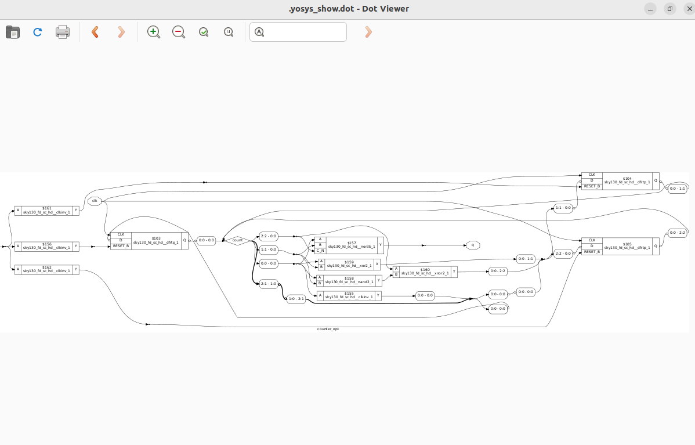
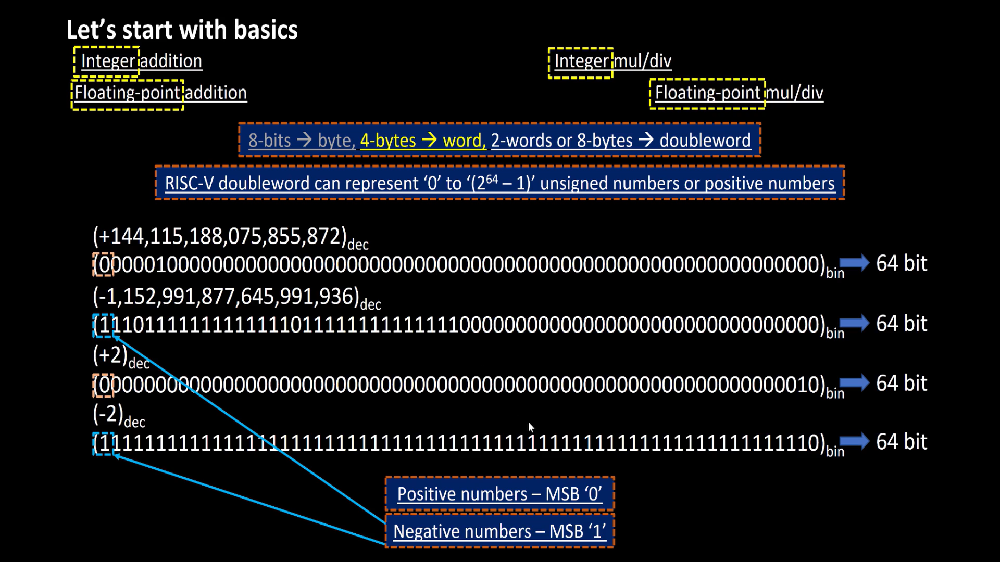
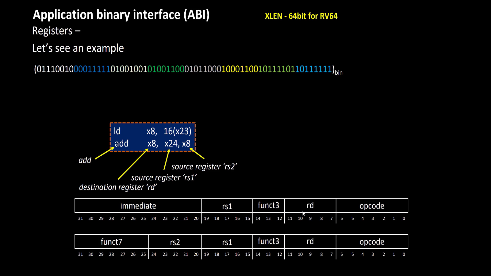
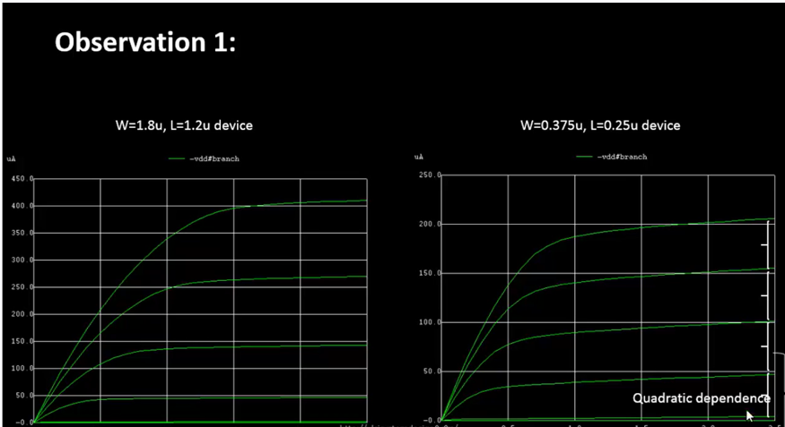
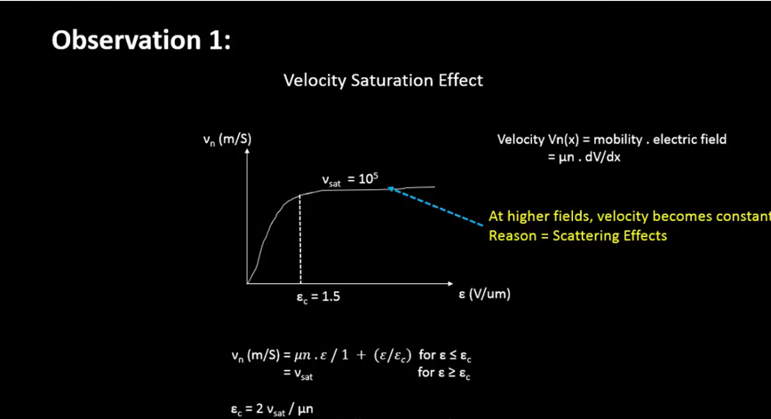
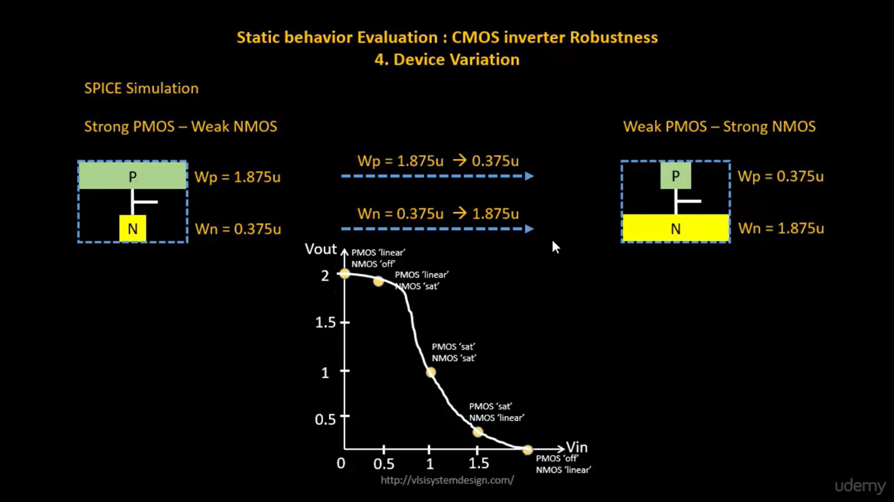
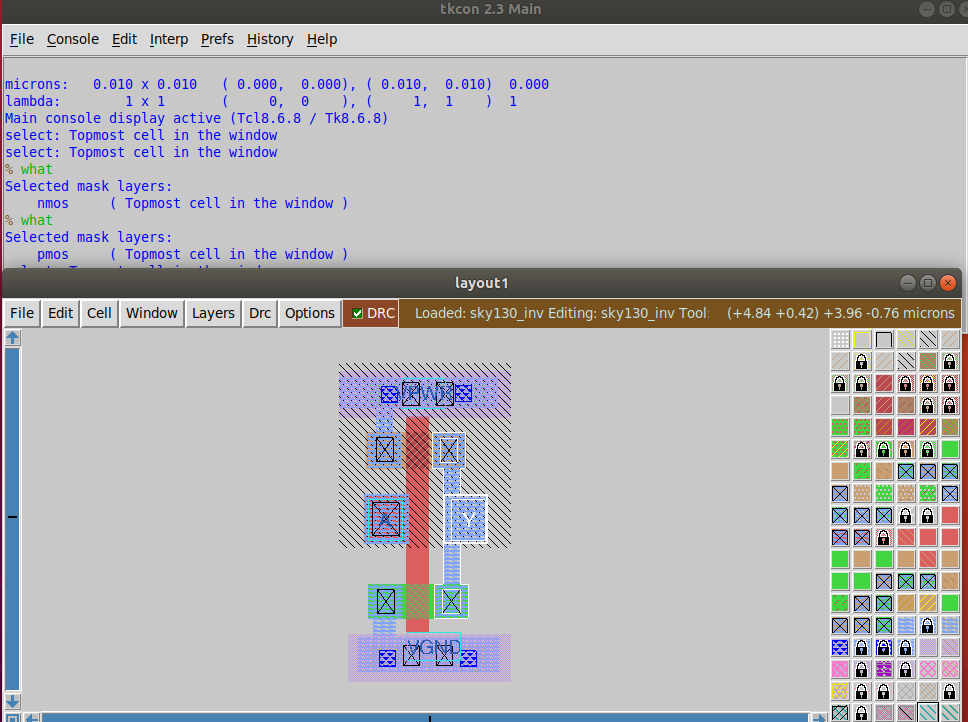

# VSD-Hardware Design program
This repository contains all the necessary steps and files to implement the RTL-to-GDSII flow.


[Day 0-Installation of EDA Tools](#day-0)

[Day 1-Introduction to Verilog RTL design and Synthesis](#day-1)

[Day 2-Timing libs, hierarchical vs flat synthesis and efficient flop coding styles](#day-2)

[Day 3-Combinational and sequential optimizations](#day-3)

[Day 4-GLS,blocking vs non-blocking and Synthesis-Simulation mismatch](#day-4)

[Day 5-Introduction to RISC-V ISA and GNU compiler tool chain](#day-5)

[Day 6-Introduction to ABI and basic verification flow](#day-6)

[Day 7-RTL and NETLIST simulation of RISCV ](#day-7)

[Day 8-Basics of STA and Advanced SDC constraints ](#day-8)

[Day 9-Basics of NMOS drain current(Id) vs Drain to Source voltage(Vds) ](#day-9)

[Day 10-Velocity Saturation and Basics of CMOS inverter VTC ](#day-10)

[Day 11-CMOS switching threshold and dynamic simulations ](#day-11)

[Day 12-CMOS Noise Margin Robustness evaluation ](#day-12)

[Day 13-CMOS Power supply and device variation robustness evaluation](#day-13)

[Day 14-Post synthesis STA checks for RISCV design on ss,ff,and, tt corners](#day-14)

[Day 15-Inception of open-source EDA, OpenLANE and Sky130 PDK](#day-15)

[Day 16-Good floorplan vs bad floorplan and introduction to library cells](#day-16)

[Day 17-Design library cell using Magic Layout and ngspice characterization](#day-17)

[Day 18-Pre-layout timing analysis and importance of good clock tree](#day-18)

## DAY 0
Install [oracle VM virtual box](https://www.virtualbox.org/wiki/Downloads) and install ubuntu in oracle VM virtual box.
If system has 16GB RAM and 512GB HDD then allocate 8GB RAM and 100 GB HDD for oracle VM virtual box.
<details>
    
<summary>INSTALLATION OF OPEN SOURCE EDA TOOLS (Yosys, iverilog, and, gtkwave)</summary>

**1.Yosys**:
Open terminal in ubuntu and use the commands shown below to install Yosys:

```bash
git clone https://github.com/YosysHQ/yosys.git
cd yosys-master 
sudo apt install make 
sudo apt-get install build-essential clang bison flex \
    libreadline-dev gawk tcl-dev libffi-dev git \
    graphviz xdot pkg-config python3 libboost-system-dev \
    libboost-python-dev libboost-filesystem-dev zlib1g-dev
make config-gcc
make 
sudo make install
```

Below screenshot shows successful installation and launching of Yosys


**2.iverilog:**
Open terminal in ubuntu and use the commands shown below to install iverilog
```bash
sudo apt-get install iverilog
```

Below screenshot shows successful installation and launching of iverilog:


**3.gtkwave:**

Open terminal in ubuntu and use the commands shown below to install gtkwave:
```bash
sudo apt-get install gtkwave
```

Below screenshot shows successful installation and launching of gtkwave:


</details>

## DAY 1

    
* RTL design is implementation of specifications.

* To check whether the design meets specifications, we need a test bench to test it under different stimulus.

* We need a tool to check whether the RTL design meets specifications. iverilog is an opensource eda tool which can be used to check the functionality of design.

* The important point is that tool looks for only changes in the input and generates the changes in the output.
  


## **RTL design and synthesis of two input MUX:**

* This [repository](https://github.com/kunalg123/sky130RTLDesignAndSynthesisWorkshop.git) contains all the verilog codes and its corresponding testbenches. Now clone the repository to your directory using git clone command.
<details>
 <summary>iverilog based simulation flow</summary>

* We have to provide Verilog code and corresponding test bench to the iverilog tool and the iverilog tool generates **a.out** file

**command to perform above operation**  
```bash
iverilog good_mux.v tb_good_mux.v
```
* We need to execute **a.out** file using the command shown below:

```bash
./a.out
```
* After execution **a.out** file , it is going to dump **VCD**(value change dump) file.

* We have to provide **VCD** file to gtkwave to view the waveform.

* Command to launch gtkwave is shown below

```bash
gtkwave tb_good_mux.vcd
```

* After executing the above command, you will see a waveform just like the image shown below:


</details>

<details>
<summary>Synthesis using Yosys:</summary>

* Yosys is an open source eda tools which is used convert RTL code to gate level netlist.

* We have to provide .lib file and verilog code file to the synthesizer **Yosys** . Then it generates a netlist of the verilog code using standard cells in the .lib file 

* .Lib file contains collection of logical modules like all basic gates and different flavours of same gate. We have to use required gate to meet specifications using **SDC** constraints.

* Now launch **Yosys** using the command shown below:

 ```bash
yosys
```
* Now we have to read **.lib** file using the command shown below:

```bash
read_liberty -lib <path to the .lib file>
```
* Now we have to read **verilog** file using the command shown below:

```bash
read_verilog good_mux.v
```
* After executing the above command you should get a message saying that **successfully finished verilog frontend**.

* Now synthesis can be performed using the command shown below:

```bash
synth -top good_mux
```
* To generate the netlist use the command shown below:
 
```bash
abc -liberty <path to .lib file>
``` 
* To see the logic it has realized to generate the netlist use the command shown below:

```bash
show
```
* 2-input mux is realized like this:


* The command to write the netlist is shown below:

 ```bash
write_verilog good_mux_netlist.v
```

* netlist looks like this 


* To write the netlist which is more clear than the previous one ,then use the following command:

 ```bash
write_verilog -noattr good_mux_netlist.v
```

</details>

## DAY 2

<details>
    
<summary>1.Timings Libs</summary>

* Timing Libs contains different type of gates.


* In the above image you can notice the library **sky130_fd_sc_hd_tt_025C_1v80**. tt refers to typical process, 025c refers to temperature and, 1v80 refers to voltage. We want the chip to work correctly irrespective of process, voltage and, temperture.


* In the above image you can notice different leakage power for same gate for different combinations of input. Similarly .lib file contains many combinations of same cells and their properties.


    
</details>

<details>
<summary>2.Hierarchical vs flat synthesis</summary>

<details>
    
<summary>2a.Hierarchical</summary>

* To understand the difference between hierarchical vs flat synthesis.Let's consider a multiple_modules.v (this verilog code is present in **../sky130RTLDesignAndSynthesisWorkshop/verilog_files**).


* From the above verilog code we can easily see that it contains OR gate(sub_module2) and AND gate(sub_module1) and these are instantiated in the multliple_modules block.

* After synthesis, the netlist contains same submodules which are instantiated in the multiple_modules.
 

* But **or** gate is implemented using Nand gate and inverters. Because nand gate contains stacked nmos transistors and synthesis tool did because stacked pmos transistors are not recommended because if we want to implement using PMOS stack then we need increase size of pmos stack to compensate for the less mobility.

* You can observe that in the image shown below.


</details>
<details>
<summary>2b.Flat synthesis</summary>

* In heirarchical synthesis heirarchy is preserved whereas in flat synthesis heirarchy is flattened.
* To view flat synthesis netlist use command **flatten** then type the command **show**. Then you will get a netlist for the multiple_modules.v code.
* Netlist is shown below.
 


* From the above image you can notice that heirarchy is flattened.
    
</details>
<details>
<summary>2c.Sub module synthesis</summary>

* Sub module synthesis is used when we have multiple instances of same module.
* It is also used when we have massive design. In this scenario synthesis tool uses **divide and conquer** method.
* By using command **synth -top submodule1** we can synthesis only submodule1. whereas in previous case we have synthesized entire multiple_modules.
* Below image shows the netlist of submodule1.
 


</details>
    
</details>

<details>
<summary>3.Efficient flop coding styles</summary>
    
 **WHY FLOPS?**
    
* If we just use combinational circuits then we encounter glitches.To avoid glitches we need flops in between combinational circuits.
* In flipflops we can have asynchronous set, asynchronous reset, synchronous set and, synchronous reset.

<details>
    <summary>3a.DFF_asynchronous reset</summary>

* commands to perform simulation:

```bash
iverilog dff_asyncres.v tb_dff_asyncres.v
./a.out
gtkwave tb_dff_asyncres.vcd
```
* Simulation of dff_asyncres.v is shown below:


* commands to perform synthesis:

* If we have flops in our design then we have to use one extra command in yosys .That is **dfflibmap** .

```bash
read_verilog dff_asyncres.v
read_liberty -lib <path to lib file>
synth -top dff_asyncres
dfflibmap -liberty <path to lib file>
abc -liberty <path to lib file>
write_verilog -noattr dff_asyncres_netlist.v
show
```
* Synthesis of dff_asyncres.v is shown below.
  

  
    
</details>

<details>
    <summary>3b.DFF_asynchronous set</summary>

* commands to perform simulation:

```bash
iverilog dff_async_set.v tb_dff_async_set.v
./a.out
gtkwave tb_dff_async_set.vcd
```
* Simulation of dff_async_set.v is shown below:


* commands to perform synthesis:

* If we have flops in our design then we have to use one extra command in yosys .That is **dfflibmap** .

```bash
read_verilog dff_async_set.v
read_liberty -lib <path to lib file>
synth -top dff_async_set
dfflibmap -liberty <path to lib file>
abc -liberty <path to lib file>
write_verilog -noattr dff_async_set_netlist.v
show
```
* Synthesis of dff_async_set.v is shown below.
  

  
    
</details>


<details>
    <summary>3c.DFF_synchronous reset</summary>

* commands to perform simulation:

```bash
iverilog dff_syncres.v tb_dff_syncres.v
./a.out
gtkwave tb_dff_syncres.vcd
```
* Simulation of dff_syncres.v is shown below:


* commands to perform synthesis:

* If we have flops in our design then we have to use one extra command in yosys .That is **dfflibmap** .

```bash
read_verilog dff_syncres.v
read_liberty -lib <path to lib file>
synth -top dff_syncres
dfflibmap -liberty <path to lib file>
abc -liberty <path to lib file>
write_verilog -noattr dff_syncres_netlist.v
show
```
* Synthesis of dff_syncres.v is shown below.
  

  
    
</details>


    
</details>

<details>
    <summary>4.Interesting Optimizations</summary>
    
## Multiplication by 2:
* If a n bit number is to be multiplied by 2 then the resulting number will be same number concatenated by a zero at the LSB side.
* To verify this we have to perform synthesis and observe the netlist.
* Netlist shown below confirms our observation


* Netlist view is shown below

 


## Multiplication by 9:

* Lets assume there is one 3 bit number a[2:0] and one 6 bit number y[5:0]. If we want to perform the operation y =a*9 then we can split it into a * 8 + a *1. where a *8 is nothing but a000 from the observation we did in multiplication by 2. Now we have add a to a000 ,so the resulting expression becomes aa.
* To verify this we have to perform synthesis and observe the netlist.
* Netlist view is shown below

 

 * From mul2 and mul9 ,what we can observe is that these operations does not require any hardware, only wires are enough.

</details>

## DAY 3

<details>
    <summary>1.Introduction to optimizations</summary>
    
## Combinational Logic Optimization

* squeezing the logic to get the most optimized design (Area and Power savings)
* Constant Propagation(Direct optimization)
* Boolean Logic Optimization(K-Map,Quine McKluskey)
  
**CONSTANT PROPAGATION: EXAMPLE**


**Boolean Logic Optimisation**


## Sequential Logic Optimizations

* Basic optimization(Sequential Constant Propagation)


* Advanced optimizations(state optimization,retiming, and, sequential logic cloning(floorplan aware synthesis))


  
</details>

<details>
    <summary>2.Combinational Logic Optimizations</summary>
    
* To perform optimization we need to use one more command after **synth -top modulename** that command is **opt_clean -purge**.
<details>
    <summary>2a.Optimization-check1</summary>


</details>
<details>
    <summary>2b.Optimization-check2</summary>


</details>
<details>
    <summary>2c.Optimization-check3</summary>


</details>
<details>
    <summary>2d.Optimization-check4</summary>
    

</details>
    
</details>

<details>
    <summary>3.Sequential Logic Optimizations</summary>

<details>
    <summary>3a.DFF_const1</summary>

* Simulation shows that output of flipflop is not constant irrespective of clk ,reset


* Observe that stats contains flipflop because as **q** is not constant. whenever q is not constant we can not optimize it.


</details>


<details>
    <summary>3b.DFF_const2</summary>

* Simulation shows that output of flipflop is constant irrespective of clk ,reset
  


* Observe that stats contains no flipflop because as **q** is constant. whenever q is constant we can optimize it.
  


</details>

<details>
    <summary>3c.DFF_const3</summary>
    
* Simulation shows that output of flipflop is not constant irrespective of clk ,reset and set
    


* Synthesis shows that flops can not be optimized in this case as Q,Q1 is not constant.


</details>

<details>
    <summary>3d.DFF_const4</summary>

* Simulation shows that output of flipflop is constant irrespective of clk ,reset


</details>

<details>
    <summary>3e.DFF_const5</summary>

* Simulation shows that output of flipflop is not constant irrespective of clk ,reset and set
    


</details>


    
</details>

<details>
    <summary>4.Sequential optimizations for unused outputs</summary>

* If outputs are not going to be having a direct role in determining primary outputs of modules. Then all those intermediate outputs will be optimized away.

<details>
    <summary>4a.counter_opt</summary>
* This is the case where primary outputs of modules are not dependent on intermediate outputs. so the logic related to the intermediate outputs is optimized.


</details>

<details>
    <summary>4b.counter_opt(different_version)</summary>
    
* This is the case where primary outputs of modules are dependent on intermediate outputs. so the logic related to the intermediate outputs can not be optimized.



</details>

        
</details>

## DAY 4

<details>
    <summary>1.GLS, Synthesis-Simulation mismatch</summary>
    
 <details>   
    <summary>1a.GLSConcepts and flow using IVERILOG</summary> 
     
**What is GLS?**

* Running the test bench with Netlist as Design Under Test
* Netlist is logically same as RTL code. So, same test bench will align with the Design.

**Why GLS**

* Verify the logical correctness of design after synthesis
* Ensuring the timing of the design is met. For this GLS needs to be run with delay annotation(Advanced topic)
  
**GLS using IVERILOG**

* we have to provide **design** (netlist), **Gate level verilog Models**, and **Test bench** to iverilog tool and it will generate **vcd** file and using gtkwave tool and vcd file we can view the waveform

**NOTE**:

* If the gate level models are delay annotated, then we can use GLS for timing Validation.

</details>
<details>
    <summary>1b.Synthesis Simulation Mismatch</summary>
    
* Synthesis Simulation Mismatch can be caused due to **missing sensitivity list**, **blocking vs non-blocking assignments**, and **non standard verilog coding**.


</details>


</details>

<details>
    <summary>2.Labs on GLS and Synthesis-Simulation Mismatch</summary>

<details>
    <summary>2a.GLS of MUX using ternary operator</summary>
    
* As you can see there is no simulation mismatch as we are using ternary operator
* RTL simulation


* GLS
* command to perform **GLS**

```bash
iverilog  ../mylib/verilog_model/primitives.v  ../mylib/verilog_model/sky130_fd_sc_hd__tt_025C_1v80.lib  ternary_operator_mux_net.v tb_ternary_operator_mux.v
./a.out
```


        
</details>

<details>
    <summary>2b.GLS of bad mux</summary>
    
* As you can see there is simulation mismatch because of **missing sensitivity list**
* RTL simulation 


* GLS


        
</details>


</details>

<details>
    <summary>3.Labs on synthesis simulation mismatch for blocking statement</summary>

* RTL simulation
  


* GLS
  


* Clearly we can see mismatch between **RTL** and **GLS** 

    
</details>

## DAY 5

<details>
    <summary>1.Introduction to RISC-V basic keywords</summary>

* If we want to execute a c program then it is first converted into assembly level language then into machine level langauage. Computer understands machine level language and executes the program.
* RISC-V instruction set architecture (ISA) is a language of the computer. Using riscv isa we can talk to the computer. As I mentioned previously ,c program compiles into assembly level language where that assembly level language is RISC-V assembly language.
* RISC-V architecture is implemented using RTL and from RTL to Layout it is nothing but typical **RTL2GDS** flow.
* Below images show how a program is implemented in the hardware


    
</details>

<details>
    <summary>2.Labwork for RISC-V software toolchain</summary>

## Program to compute sum from 1 to n:


## RISCV GCC Compile and Disassemble:

This [file](https://github.com/kunalg123/riscv_workshop_collaterals/blob/master/run.sh) contains commands to install riscv isa simulator and gcc compiler toolchain.

* We have to compile the code sum1ton.c using riscv compiler
* command to compile is **riscv64-unknown-elf-gcc -O1 -mabi=lp64 -march=rv64i -o sum1ton.o sum1ton.c**
* To view the assembly language for this c program , the command is **riscv64-unknown-elf-objdump -d sum1ton.o | less**
  


* If we use the Ofast instead of O1 then the number of instructions in assembly will reduce.
* command **riscv64-unknown-elf-gcc -Ofast -mabi=lp64 -march=rv64i -o sum1ton.o sum1ton.c**
* Below Image shows that number of instructions are reduced from 15 to 12.

 


## Spike simulation and debug:

* A way to do **./a.out** in riscv simulator is to use command **spike pk object file**(sum1ton.o).
* If we debug then we have to use debugger, the command to debug is **spike -d pk sum1ton.o**
* To know the content in the register use command **reg 0 a2**(register name)


* LUI(load upper immediate)


* ADDI(add immediate)


</details>

<details>
    <summary>3.Integer number representation</summary>

## 64 bit number system for unsigned numbers:


## 64 bit number system for signed numbers:





## Lab for unsigned and signed numbers:


</details>

## DAY 6

<details>
    <summary>1.Application Binary Interface(ABI)</summary>

<details>
    <summary>1a.Introduction to ABI</summary>


    
</details>

<details>
    <summary>1b.Memory allocation for Double words</summary>


    
</details>

<details>
    <summary>1c.Load,Add and Store instructions with example</summary>





    
</details>

<details>
    <summary>1d.Concluding 32-registers and their respective ABI names</summary>


</details>

</details>

<details>
    <summary>2.Lab work using ABI function calls</summary>


</details>

<details>
    <summary>3.Basic verification flow using iverilog</summary>
    


* Commands to convert c program into hex format file and store it in the memory


    
</details>

## DAY 7

* This [file](https://github.com/vinayrayapati/rv32i) contains **RISCV** verilog code and it's testbench.
* The main goal of day 7 is to get the same waveform for pre and post synthesis.
<details>
    <summary>RTL Simulation of RISCV :</summary>

* Use the same commands that i have used previously for **RTL** simulation.
* RTL simulation of RISCV


</details>

<details>
    
   <summary>Synthesis of RISCV :</summary>

* Use the same commands that i have used previously for Synthesis.


</details>

<details>
<summary> Netlist simulation of RISCV :</summary>

* Use the same commands that i have used previously for **Netlist** simulation.


* Resulting waveform is different from the pre-synthesis simulation waveform.
* I have used the command "iverilog **-DFUNCTIONAL -DUNIT_DELAY=#1** ../mylib/verilog_model/primitives.v ../mylib/verilog_model/sky130_fd_sc_hd.v iiitb_rv32i_net.v iiitb_rv32i_tb.v" to resolve the issue but i got a **syntax error**.
* To solve the syntax error follow the steps given in this [link](https://github.com/The-OpenROAD-Project/OpenLane/issues/518).
* After solving you will get a waveform just like the image shown below.
  


</details>
<details>
    <summary>Comparison between RTL and NETLIST simulation of instruction ADD R6,R2,R1</summary>
    
* If we observe the verilog code, location M[0] contains Add r6,r2,r1 instruction.


* From the image shown below ,contents of r2 =2 and r1 =1 and after execution of instruction one **( Add r6,r2,r1)** content of r6 should be equal to 3. And, We have to get r6=3 for both RTL and NETLIST simulation.


* Below image shows that RTL simulation waveform is same as Netlist simulation waveform for instruction **one**. And, also **r6=3** for both RTL and NETLIST simulation


</details>

## DAY 8
<details>
    <summary>1.STA theory and SDC</summary>

**Is Delay of a Cell Constant?**
* Delay of a cell is function of **input transition and output load**
* There will be different kinds of path in a design and as every path works on a clock, we need to squeeze the combinational logic in between any paths such that it works for that given clock period.
* If that is to be done then we need to answer two questions  **1. what is the acceptable delay?** and **2.will clock arrive at the same time at all the flops?**

**TIMING PATHS**
* start points (input ports, clock pin of registers)
* End points (output ports, D pin of DFF or DLAT)
* Always timing paths start at one of the staring points and end at one of the end points.
* clk to D(**REG2REG Timing path**)
* clk to output(**IO timing path**)
* input to D(**IO timing path**)
* input to output(**IO timing path** that ideally should not be present.)
* clock period will **limit the delays** in all REG2REG timing path.

**How different path are constrained**
* REG2REG path is constrained by **clock**
* IN2REG timing path is constrained by **input external delay, input transition(delay of a cell depends on input transition), and clock**
* REG2OUT timing path is constrained by **output external delay, output load(delay of a cell depends on output load), and clock**
* IN2REG and REG2OUT are called IO paths and the delay modelling referred above is called **IO Delay Modelling**.

**CLOCK MODELLING**
* As clock will not arrive at the same time at all the flops. we need to model the clock as well.
* We have to model the clock for the following
  
   - 1.Period
   - 2.Source Latency : Time taken by the clock source to generate clock.
   - 3.Clock Network Latency : Time taken by the clock distribution network.
   - 4.Clock Skew : Clock path delay mismatches which causes difference in the arrival of the clock.
   - 5.Jitter : stochastic variations in the arrival of clock edge.
   - 6.collectively Clock Skew and Jitter is called **clock uncertainity**.
   - 7.Post CTS, the clock network is real, and hence these modelled clock skew and clock network latency **must be removed**.

  
</details>

<details>
    <summary>2.Lab using OpenSTA</summary>


</details>

<details>
    <summary>3.Explanation of SDC constraints</summary>
    
* RISCV IO's ports are RN, NPC and WB_OUT where **RN** is the input port and **NPC** and  **WB_OUT** are the output ports.
    


**IMPORTANT POINT** - Max and Min delay constraints are used to account for setup and hold respectively.


* create_clock -period 10 -name clk {clk}
   - This command is used to create a clk with a period of 10ns.

* set_clock_latency -source -max 3 {clk}
   - This command is used to model the clock for source latency .
    
* set_clock_latency -source -min 1 {clk}
   - This command is used to model the clock for source latency .

* set_clock_uncertainty -setup 0.5 [get_clock clk]
   - This command is used to model the clock uncertainties(skew, jitter)
     
* set_clock_uncertainty -setup 0.2 [get_clock clk]
   - This command is used to model the clock uncertainties(skew, jitter)

* set_input_delay -max 3 [get_ports RN]
   - This command is used to model **input external delay** wrt setup
     
* set_input_delay -min 1 [get_ports RN]
   - This command is used to model **input external delay** wrt hold

* set_input_transition -max 0.5 [get_ports RN]
   - This command is used to model input transition (as delay of a cell depends on input transition)y
     
* set_input_transition -min 0.1 [get_ports RN]
   - This command is used to model input transition (as delay of a cell depends on input transition)

* set_output_delay -clock clk -max 5 [get_ports NPC]
   - This command is used to model **output external delay** wrt setup

* set_output_delay -clock clk -min 1 [get_ports NPC]
   - This command is used to model **output external delay** wrt hold
 
* set_output_delay -clock clk -max 5 [get_ports WB_OUT]
   - This command is used to model **output external delay** wrt setup

* set_output_delay -clock clk -min 1 [get_ports WB_OUT]
   - This command is used to model **output external delay** wrt hold
</details>

## DAY 9
<details>
    <summary>Why do we need SPICE?</summary>

* Below image shows delay model table for a gate.This delay table gives delay of a gate for a particular input transition and output load. we do spice simulations to get 
  delay of a gate for different combinations of input transition and output load.

</details>

<details>
    <summary>NMOS structure and Operation</summary>

* From the images shown below we can easily understand the NMOS operation and structure


</details>

<details>
    <summary>What is the effect of the Vsb voltage on threshold voltage</summary>

* From the images shown below we can easily understand the effect of the **Vsb** voltage on threshold voltage (**vt**)


</details>

<details>
    <summary>Derivation of Drain current</summary>
    


</details>

<details>
    <summary>What is Pinchoff phenomenon?</summary>
    


* Pinch off starts when channel voltage (**vgs-vds**) is less than or equal to **Vt**.


* When channel voltage is less than or equal to **vt** then channel voltage is going to be constant i.e(**vgs-vt**)
* If we substitute **vds=vgs-vt** in drain current equation then we can model this as constant current source as it is independent of **vds**.
* But is it true ? No its not, you can observe that in the image shown below


</details>

<details>
    <summary>Spice simulation using NGSPICE</summary>
<details>
    <summary>How to setup spice</summary>
    
* Images shown below explains how to setup spice simulations


</details> 

<details>
    <summary>Id vs VDS(for different vgs)</summary>

* This [file](https://github.com/kunalg123/sky130CircuitDesignWorkshop.git) contains all necessary files for NGSPICE.
* Simulation commands:


* plot


        
</details>
</details>

## DAY 10

<details>
    <summary>1.Velocity Saturation (observation 1)</summary>
    
* when we go to lower channel length then we will observe difference in the waveform . This is because of velocity saturation
    
  





</details>

<details>
    <summary>2.Velocity Saturation (observation 2)</summary>
    
* According to the current equation it seems that current increase when we go lower channel length. But it is not true, current saturates and doesnot increase because of **velocity saturation**.

 

</details>

<details>
    <summary>3.Lab on velocity saturation</summary>


    
</details>

<details>
    <summary>4.basics of CMOS Inverter(VTC)</summary>


</details>

## DAY 11

<details>
    <summary>1.VTC using NGSPICE</summary>


</details>

<details>
    <summary>2.switching threshold(Vm)</summary>

* Switching threshold is the voltage at which **vin=vout**


</details>
<details>
    <summary>3.VTC and transient simulation of CMOS inverter</summary>

* If length of both NMOS and PMOS is constant and width of PMOS is integer multiple of NMOS then we will observe that VTC curve moves towards right. To know the advantage of this we can perform transient simulation and observe rise delay and fall delay.
* Below image shows rise delay and fall delay for different PMOS widths.

* If we observe when PMOS width is twice of NMOS width then rise delay and fall delay are equal. One of the applications where this is used is clock tree. In clock tree we need equal rise time and fall time. Remaining are used in different applications such as buffer in the combinational delay path etc..,


</details>
<details>
    <summary>Transient simulation of CMOS inverter.</summary>

* Spice simulation commands to perform transient simulation:


* Transient simulation:


</details>

## DAY 12

<details>
    <summary>1.Noise Margin</summary>

* Any input voltage level between **0** and **VIL** will be treated as Logic 0. The output for this input will lie between and **VOH** and **VDD** i.e(logic 1)
* Any input voltage level between **VIH** and **VDD** will be treated as Logic 1. The output for this input will lie between and **0** and **VOL** i.e(logic 0)
* **IMPORTANT POINT-** VOH must be greater than VIH to be treated as logic 1 for next stage. similarly VOL must be lesser than VIL.
* Images shown below explains more about noise margin.


* we need higher noise margin for greater noise immunity.
* If we increase **PMOS WIDTH** by keeping **NMOS WIDTH** constant then we observe that Noise margin high(**NMH**) increases and whereas **NML** remains constant. But if we further increase PMOS WIDTH then there will be no increase in NMh and  also we will notice decrease in NML because NMOS is weaker than PMOS.
* Image shown below explains about this:


* **ONE MORE IMPORTANT POINT** is that after fabrication if there is any variation in widths then NMh,NMl and Vm are not going to change that much. Basically the variation in NMH and NML will less than 5%.

</details>
<details>
    <summary>2.Lab on Noise Margin</summary>


* From above image VIL=0.758, VOH=1.72, VIH=0.991 and,VOL=0.086. so, **NMH**=VOH-VIH=1.72-0.991=**0.729** and **NML**=VIL-VOL=0.758-0.086=**0.672**.

</details>

## DAY 13

<details>
    <summary>1.power supply scaling</summary>

* When to go lower nodes then we have to scale down the voltage as well.


* If we observe for 0.5V supply voltage, the wave form looks different, it is because there is less time to charge and discharge the capacitor that means rise and fall delays are higher for 0.5V supply voltage when compared to higher supply voltages.


* Advantages and disadvantages of power supply scaling:

</details>

<details>
    <summary>2.Lab on Power supply scaling</summary>
    
* Spice simulation commands


* Observe that gain increases as supply voltage increases but for 0.8V supply voltage gain was less because 0.8V supply is not enough to drive PMOS and NMOS.


</details>
<details>
    <summary>3.Sources of variation(Etching process variation)</summary>

* Below images explain about Etching process variation:


</details>
<details>
    <summary>4.Sources of variation(Oxide thickness)</summary>

* Below images explain about Oxide thickness variation:


</details>
<details>
    <summary>5.CMOS inverter robustness in presence of variations</summary>

* Below images explain about CMOS inverter robustness in presence of variations:


    
</details>
<details>
    <summary>6.Lab work proving the CMOS robustness</summary>

* Spice simulation commands


* Ideally switching threshold should be 0.9V for 1.8V power supply but if we observe the image shown below(strong PMOS and weak NMOS) switching threshold is 0.98V . As the variation in switching threshold  is less. we can say that CMOS inverter is robust.
 

</details>

## DAY 14

* Same sdc constraints were used with different PVT corners and also generated its corresponding TNS,WNS, and WHS.
* This [repo](https://github.com/Geetima2021/vsdpcvrd.git) contains all timing libs which were used for PVT corner analysis.
* I have tabulated all the values and plotted the graphs as well.
<details>
<summary>PVT corner analysis table</summary>    
    

</details>

<details>
<summary>Graph</summary>
    

</details>


## DAY 15

<details>
    <summary>1.How to talk to computers</summary>

* Below image explains how we talk to computer which is RISCV based


</details>

<details>
    <summary>2.SoC design and OpenLANE</summary>

**What do we need for ASIC design?**


**What is PDK?**


**ASIC FLOW**

</details>

<details>
    <summary>3.Get familiar to open-source EDA tools</summary>

<details>
    <summary>3a.Design Preparation Step</summary>
    


</details>

<details>
    <summary>3b.Run synthesis and characterize synthesis results</summary>

* Calculating Flop ratio from the results which is in the runs folder
**FLOP RATIO=1613/14876=0.108**


</details>

<details>
    <summary>3c.Commands to invoke openLANE and run synthesis</summary>
    
```bash

docker
./flow.tcl -interactive
package require openlane 0.9
prep -design picorv32a
run_synthesis
```
</details>
</details>

## DAY 16

<details>
    <summary>1.Chip Floor Planning considerations</summary>

**Steps to perform floor planning**

1.Utilization factor and aspect ratio. Where utilization factor =**Area occupied by the netlist/Total area of the core** and aspect ratio = **height of the core/width of the core**

2.Preplaced cells- Whenever a particular combinational logic block is used multiple times in the designs. we have to implement them only once and can use it whenever we need it.

3.De-coupling capacitors - Decoupling capacitors are placed around the pre-placed cells because supply voltage from vdd degrades when it reaches to the pre-placed cell because of voltage drop.So De-coupling capacitors are placed in order to reduce voltage drop from Vdd.

4.Power planning - It is not possible to place Decoupling capacitors around every logic block.So power planning is done to avoid voltage droop and ground bounce.

5.Pin Placement and Logical cell Placement Blockage - After power planning Pin placement is done according to the netlist and Clock pins are larger in size than Input/Output ports because clock has to go to every place in the chip , so to avoid degradation in the clock, clock pins are larger because larger than size lesser the resistance.

6.After this Floorplan is ready for placement and routing.

* Below image explains the steps involved in the floor planning


</details>
<details>
    <summary>2.Lab on Floorplanning</summary>

* command to perform floorplanning **run_floorplan**.
* Below image shows succesful floorplan of **picorv32a.**


* To open floorplan in magic use the below command:
  
```bash
magic -T ../../../../../../../pdks/sky130A/libs.tech/magic/sky130A.tech lef read ../../tmp/merged.lef def read picorv32a.floorplan.def &
```
* Below image shows the floorplan which was done.


  

</details>
<details>
    <summary>3.Library Binding and Placement</summary>

**Steps to perform placement:**

1. Bind netlist with physical cells

2. Placement

3. Optimize placement (**This is the stage where we estimate wire length and capacitance and, based on that, insert repeaters**)

4. Perform STA(**Setup time analysis**)
   
* Image shown below describes how the design looks after placement:

</details>
<details>
    <summary>4.Lab on placement</summary>

* Command to perform placement **run_placement**

* Command to view design in magic after placement

```bash
magic -T ../../../../../../../pdks/sky130A/libs.tech/magic/sky130A.tech lef read ../../tmp/merged.lef def read picorv32a.placement.def &
```

* This is how design looks like after placement


</details>

<details>
    <summary>5.Cell design and characterization flow</summary>
    
   
* Images shown below explain cell design and characterization flow.


</details>
<details>
    <summary>6.General timing characterization parameters</summary>


**Poor choice of threshold points leads to negative delay**


**Negative delay is also possible if there is high wire delay between two inverters.**


**Transition time**


</details>

## DAY 17

<details>
    <summary>1.IO placer revision</summary>

* As we know PnR is done iteratively. The command to place pins(not equidistant)

```bash
set ::env(FP_IO_MODE) 1; # 0 matching mode - 1 random equidistant mode
```


</details>
<details>
    <summary>2.Lab</summary>

* Cloned a custom design from github for the purpose of characterization
* cloned form **https://github.com/nickson-jose/vsdstdcelldesign.git**
* commands to open the design in magic.

```bash
 magic -T sky130A.tech sky130_inv.mag
```
    

</details>

<details>
    <summary>3.Inception of layout and CMOS fabrication process</summary>

* Steps involved in the CMOS fabrication process.

**16-mask CMOS process**

1.selecting a substrate


2.Creating Active region for transistors


3.N-Well and P-Well formation


4.Formation of Gate


5.Lightly doped drain (LDO) formation


6.Source and Drain formation


7.Steps to form contacts and interconnects(local)


8.High Level Metal formation


**Now it is ready for fabrication**


</details>

<details>
    <summary>4.Lab to create std cell layout and extract spice netlist</summary>
    


* commands to extract spice netlist.

```bash
extract all
ext2spice cthresh 0 rthresh 0
ext2spice
```


</details>

<details>
    <summary>5.Lab to create SPICE deck and characterize the inverter</summary>

* Spice deck:


* Characterization of Inverter using ngspice:


 
</details>
<details>
    <summary>6.Lab on DRC(Design rule checking)</summary>

* Commands to get mag files.

```bash
wget http://opencircuitdesign.com/open_pdks/archive/drc_tests.tgz
tar xfz drc_tests.tgz
```
* command to invoke magic is **magix -d XR**

* Met3.mag file in magic looks like


* DRC fix (poly.9)


</details>

## DAY 18

<details>
    <summary>1.Timing modelling using delay tables</summary>
<details>
    <summary>1a.Lab steps to convert grid info to track info</summary>


    
</details>
<details>
    <summary>1b.Lab steps to convert magic layout to std cell LEF </summary>


</details>
<details>
    <summary>1c.Introduction to timing libs and steps to include new cell in synthesis</summary>

* Now we have to copy generated lef file into src folder.
* Then we have to modify config.tcl file. We have to insert commands shown below in the config.tcl file before synthesis.
  
```bash
set ::env(LIB_SYNTH) "$::env(OPENLANE_ROOT)/designs/picorv32a/src/sky130_fd_sc_hd__typical.lib"
set ::env(LIB_FASTEST) "$::env(OPENLANE_ROOT)/designs/picorv32a/src/sky130_fd_sc_hd__fast.lib"
set ::env(LIB_SLOWEST) "$::env(OPENLANE_ROOT)/designs/picorv32a/src/sky130_fd_sc_hd__slow.lib"
set ::env(LIB_TYPICAL) "$::env(OPENLANE_ROOT)/designs/picorv32a/src/sky130_fd_sc_hd__typical.lib"
set ::env(EXTRA_LEFS) [glob $::env(OPENLANE_ROOT)/designs/$::env(DESIGN_NAME)/src/*.lef]
```

* After Prep -design picorv32a step , we have to insert commands shown below.
```bash
set lefs [glob $::env(DESIGN_DIR)/src/*.lef]
add_lefs -src $lefs
```
* Below image shows that synthesis used  **1554  sky130_vsdinv** cells.
  
</details>

<details>
    <summary>1d.Introduction to delay tables and their usage</summary>

* Image shown below explains everything about delay table and their usage.


</details>

<details>
    <summary>1e.Lab steps to configure synthesis settings to fix slack and include vsdinv</summary>

* To reduce slack I have used following commands :

```bash
set ::env(SYNTH_STRATEGY) "DELAY 1"
set ::env(SYNTH_SIZING) 1
run_synthesis
```

* Area and slack before using above commands:


* Area and slack after using commands:


* Here we comprised with area to improve slack.

* We have to verify whether our custom cell is plugged into design after placement.
  
 
</details>

</details>
<details>
    <summary>2.Timing analysis with ideal clocks using openSTA</summary>

<details>
    <summary>2a.Setup time analysis</summary>


</details>

<details>
    <summary>2b.Introduction to clock jitter and clock uncertainty</summary>


</details>

<details>
    <summary>2c.Lab steps to configure OpenSTA for post-synth timing analysis</summary>

* In any PnR tool if there is timing violation, we carry out analysis in separate tool.For example primetime.
* In opensoure EDA tools, we do it OpenSTA tool.
* For that we have prepare our own sdc file and config file.

**config file**


**sdc file**


</details>

<details>
    <summary>2d.Lab steps to optimize synthesis to reduce setup violations</summary>

* I got tns=0,wns=0; there were no timing violations for me. But if we encounter timing violations then we do STA analysis in separate tool(in our case OpenSTA).
* There are many ways to reduce slack . Following example is one of the ways.
```bash
set ::env(SYNTH_MAX_FANOUT) 4
```

* To see how many pins are driven by a cell, we use below command

```bash
report_net -connections <net name>
```

</details>

<details>
    <summary>2e.Lab steps to do basic timing ECO</summary>

* If a cell drives more cells than we can upsize that cell so that slack can be reduced.For upsizing we have to replace that cell with a more drive strength cell.

**command**

```bash
replace_cell instance lib_cell
```

* for example **replace_cell _41882_ sky130_fd_sc_hd_buf_4**
* To view reports whether the above command is executed or not, use this **report_checks -from _50144_ -to _50075_ -through _41882_**
* This is what people do in the industry using commercial tools. We solve violations and generate a timing eco and give it to PnR .

**IMPORTANT_POINT**

* When we replace a cell or upsize a cell or modify a cell, the netlist is going to change.So, to update netlist we have to use command shown below.

```bash
write_verilog /home/vsduser/Desktop/work/tools/openlane_working_dir/openlane/designs/picorv32a/runs/20-03_22-55/results/synthesis/picorv32a.synthesis.v
```

    
</details>

</details>

<details>
    <summary>3.Clock tree synthesis TritonCTS and signal integrity</summary>


<details>
    <summary>3a.Clock tree routing and buffering using H-tree algorithm</summary>

* Below images Clock tree synthesis.


    
</details>

<details>
    <summary>3b.Cross talk and clock net shielding</summary>

* Below images explain cross talk and clock net shielding


    
</details>

<details>
    <summary>3c.Lab steps to run CTS using TritonCTS</summary>

* To run cts use **run_cts** command.
* After CTS a new file will be created in results/synthesis folder because netlist changes after **CTS**.
* Below image shows that a new was created


* After CTS no slack violations were present.


    
</details>
</details>

<details>
    <summary>4.Timing analysis with real clocks using openSTA</summary>

<details>
    <summary>4a.Setup timing analysis using real clocks</summary>

* Image shown below explains about setup timing analysis using real clocks


</details>

<details>
    <summary>4b.Hold timing analysis using real clocks</summary>

* Image shown below explains about hold timing analysis using real clocks


    
</details>


</details>
